====================
Opmerkingen plaatsen
====================
Opmerkingen worden in het prototype enkel geplaatst op de Oplossing-webpagina's en op de relevante Review-webpagina's.
Later is het de bedoeling dat men ook opmerkingen kan plaatsen op de Oefeningen- en de Cursus-webpagina's.

Overzicht van Oplossing-webpagina
=================================

Als men op de pagina van een oplossing komt kan men aan de rechterkant de bestaande conversaties en het formulier voor het maken van een nieuwe conversatie zien.

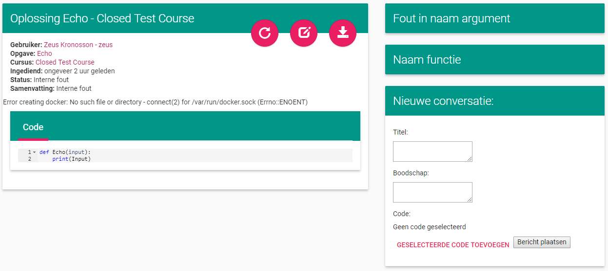

Als er op de titelbalk van een conversatie geklikt wordt, klapt de conversatie open waardoor de berichten zichtbaar worden.
Als er in de conversatie naar code gerefereerd wordt dan wordt deze in beeld gebracht en gemarkeerd. (Op de onderstaande afbeelding is het formulier om een nieuwe conversatie te starten weggelaten)

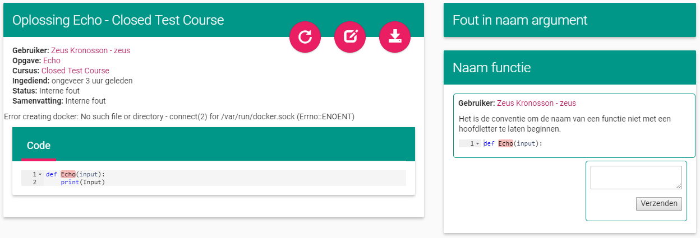

Als er opnieuw op de titelbalk wordt geklikt vouwt de conversatie weer dicht en wordt de markering op de code weggedaan.

Conversatie starten
===================
Onderstaande afbeelding geeft het scherm weer waarmee een nieuwe conversatie gestart kan worden. 
Het bevat een veld om de titel van de conversatie in te geven en een veld om de boodschap in te geven.
Verder bevat het ook twee knoppen: één om code toe te voegen en één om het bericht te plaatsen en eveneens de conversatie te starten.

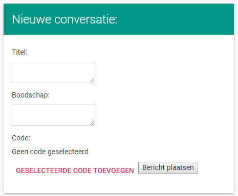

Als er geprobeerd wordt om een conversatie te starten zonder titel en/of boodschap mee te geven zal er een foutmelding verschijnen.

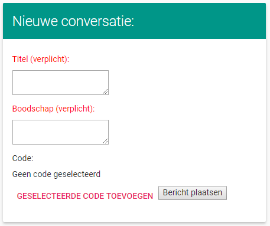

Als er code geselecteerd wordt en er op de knop voor het toevoegen van code gedrukt wordt, dan zal deze aan de conversatie gekoppeld worden.
Hieronder staan twee afbeeldingen: één voor er code toegevoegd is en één nadat code toegevoegd is.
Het is mogelijk om de code meermaals aan te passen door nieuwe code te selecteren en op de knop te drukken of om de code weg te laten door niets te selecteren en op de knop te drukken.

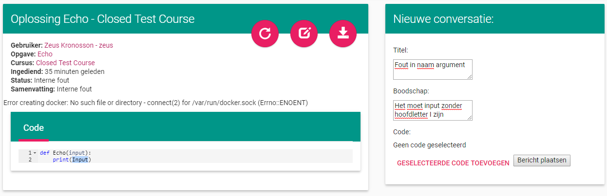

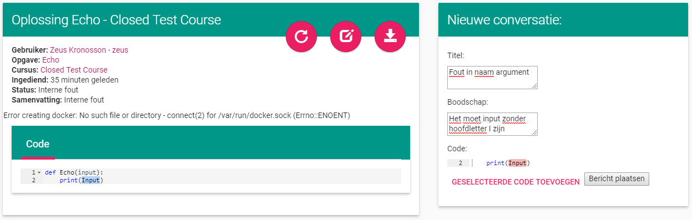

Als zowel een titel als een boodschap is ingegeven kan een conversatie gestart worden door op de knop te drukken.
Dit maakt de conversatie en het eerste bericht aan.

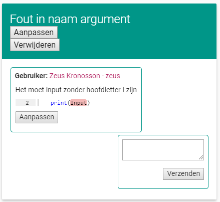

Reageren op een opmerking
=========================
Het is mogelijk om op een boodschap te reageren.
Dit kan gedaan worden door in een conversatie in het tekstvak na het laatste bericht een boodschap te schrijven en op de Verzenden knop te drukken.

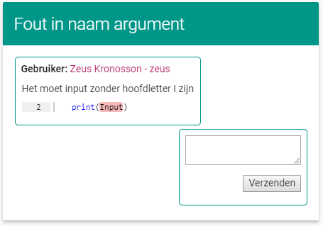

Als er niets geschreven wordt dan wordt er een foutmelding weergegeven.

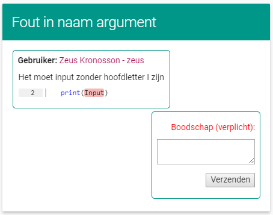

Als er tekst is ingegeven en er wordt op de knop gedrukt, dan wordt er een reactie geplaatst.

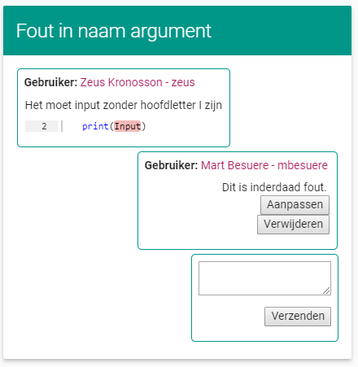

Het is mogelijk om hierna nog reacties te plaatsen op analoge manier.

Reactie aanpassen en verwijderen
================================
Het is mogelijk om een eigen geplaatste reactie aan te passen of te verwijderen.

Als er op de knop wordt gedrukt om een reactie aan te passen wordt er een formulier weergegeven waar de boodschap van de reactie aangepast kan worden.

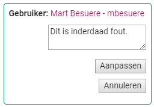

Zoals bij het aanmaken van een reactie is het verplicht om tekst in te geven, als er geen tekst wordt ingegeven wordt er weer een foutboodschap weergegeven.
Er zijn koppen om de aanpassingen door te voeren of om het aanpassen te annuleren.

Als er op de knop voor het verwijderen van een reactie wordt gedrukt, wordt er om bevestiging gevraagd.

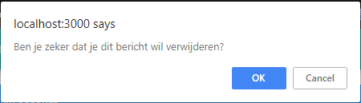

Conversatie aanpassen en verwijderen
====================================

Het is mogelijk om de titel van een conversatie aan te passen, het eerste bericht van de conversatie aan te passen en om de conversatie te verwijderen.
Voor elk van deze drie mogelijkheden zijn er knoppen voorzien.

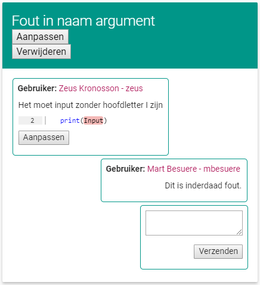

Als er op de knop om het eerste bericht aan te passen wordt gedrukt, krijgt de gebruiker een tekstvak te zien waar hij de tekst van het bericht kan aanpassen.
Hij heeft ook de optie om de geselecteerde code aan te passen (of om code aan het bericht toe te voegen als er geen code aan vast hangt).
Er zijn knoppen om de aanpassing door te voeren en om de aanpassing te annuleren.
Als er geen tekst in het tekstvak staat zal er een foutmelding weergegeven worden bij het proberen aanpassen.

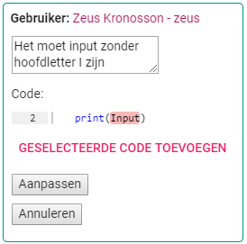

Als de knop om de titel van de conversatie aan te passen wordt ingedrukt, krijgt men een tekstvak waarin men de titel kan aanpassen.
Men kan kiezen om de aanpassing door te voeren of om te annuleren.
Als een lege titel wordt ingegeven krijgt men een foutmelding bij het proberen aanpassen.

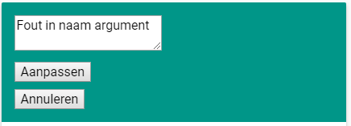

Als men probeert een conversatie te verwijderen krijgt men een bevestigingsbericht.
Het verwijderen van een conversatie houdt in dat alle berichten in deze conversatie ook verwijderd worden.

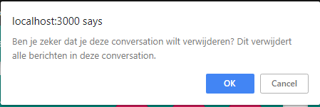