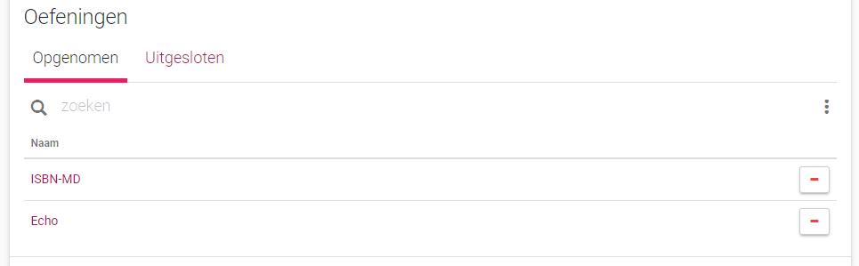
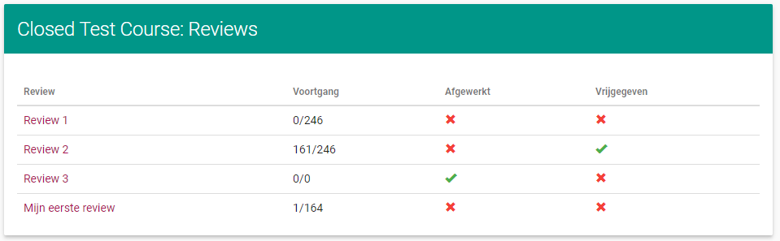

==================================
Werken met reviews als beoordelaar
==================================
De cursus webpagina is op drie plaatsen uitgebreid. 
In de beschrijving van de cursus zijn er twee knoppen geplaatst, één om een review aan te maken en één om een overzicht van alle reviews van deze cursus te bekijken. 

.. image:: images/reviews/reviewer/course_description.png

Een nieuw element op deze webpagina is een overzicht van alle beoordeelde oplossingen voor de gebruiker van deze cursus.
Dit wordt verder besproken in het deel :ref:`werken_als_gebruiker`.

.. image:: images/reviews/user/overview_reviews_as_user.png

Een laatste toevoeging is een extra optie in het menu van een reeks.
Hiermee kan een review gestart worden waarbij informatie van de reeks gebruikt wordt om de review te maken.

Review aanmaken
===============
Een review kan op twee manieren gemaakt worden: via de knop in de beschrijving van de cursus of via een knop bij een reeks.
Beide methoden leiden naar onderstaand scherm.

.. image:: images/reviews/reviewer/create_review.png

Hier kan men de review een naam geven, een deadline instellen tot wanneer oplossingen in rekening gebracht worden en instellen wanneer de opmerkingen vrijgegeven worden.
Het is verplicht een naam voor de review in te geven en een deadline te hebben, als dit niet zo is wordt er een foutboodschap weergegeven.
Een datum voor de vrijgave is niet verplicht, als dit blanco gelaten wordt dan zal de review enkel handmatig vrijgegeven worden.
Als de review aangemaakt werd via het menu van een reeks wordt de deadline automatisch ingevuld als de deadline van de reeks.
Als de reeks geen deadline heeft of de review is aangemaakt vanuit de beschrijving van de cursus, dan zal de deadline ingevuld worden als de huidige datum.

Het aanmaken van de review wordt afgerond met de knop rechtsboven in de bovenstaande afbeelding.
Alle gebruikers met als toegangsniveau student van de cursus worden geregistreerd voor de review en als de review via een reeks werd aangemaakt zullen alle oefeningen in de reeks ook geregistreerd worden.
Anders zullen er initieel geen oefeningen geregistreerd zijn.

Review bekijken
===============
De webpagina van een review bestaat uit 3 delen.

Een beschrijving waarin metadata van de review te zien is.
De knop om de review te bewerking staat hierin rechtsboven.
De beschrijving laat zien hoeveel oplossingen al beoordeeld zijn, hoeveel er nog te beoordelen zijn, hoeveel niet ingediende oplossingen er zijn en hoeveel studenten geregistreerd zijn in de review.
Hoeveel oplossingen al beoordeeld zijn is ook procentueel te zien.
De deadline is ook zichtbaar in het groen als de deadline nog niet verlopen is, rood als ze al wel verlopen is.
De datum van vrijgave is groen als ze niet verlopen is, rood als ze dat wel is.
Als er geen datum van vrijgave is zal dit aangeduid zijn.
Er is een knop aanwezig om de opmerkingen vrij te geven als ze nog niet vrijgegeven zijn en een knop om ze te verbergen als ze wel al vrijgegeven zijn.
Het vrijgeven door de knop stelt het moment als vrijgave in op het moment dat de knop is ingedrukt.
Het verbergen door de knop stelt de vrijgave in als onbepaald.

.. image:: images/reviews/reviewer/description_review.png

Een lijst van alle geregistreerde oefeningen. 
Het is mogelijk om in deze lijst te zoeken op naam van de oefeningen.
In de lijst is de naam van de oefeningen te zien, hoe veel oplossingen in de oefening al verbeterd zijn, een icoon dat aangeeft of de oefening al volledig verbeterd is en een knop om verder te gaan om de oefening in de review in meer detail te bekijken.
Als niet alle oplossingen van een oefening verbeterd zijn is er een gele waarschuwingsdriehoek te zien, anders is er een groen vinkje zichtbaar.

.. image:: images/reviews/reviewer/show_review_exercises.png

Het laatste is een lijst van alle geregistreerde gebruikers.
Dit is een spiegeling van de lijst met oefeningen.
Er is de optie te zoeken op gebruikersnaam.
In de lijst is de gebruikersnaam, de naam en het e-mailadres van de gebruiker te zien.
Er is ook te zien hoeveel oplossingen er van een gebruiker al beoordeeld zijn.
Voor elke gebruiker is er een knop om verder te gaan en deze gebruiker in de review in meer detail te bekijken.  

.. image:: images/reviews/reviewer/show_review_users.png

Review aanpassen
================
Bij het aanpassen van een review kan de naam van de review, de deadline en de datum van vrijgave aanpast worden.

.. image:: images/reviews/reviewer/edit_review_data.png

Met behulp van een lijst kan er gekozen worden welke oefeningen beoordeeld moeten worden en welke niet.

In de lijst zijn er ook opties om alle oefeningen te laten beoordeeld worden en om geen oefeningen te laten beoordelen.

.. image:: images/reviews/reviewer/edit_review_exercises_options.png

Zoals bij de lijst van oefeningen, kan er via een lijst van gebruikers beslist worden van welke gebruikers oplossingen beoordeeld moeten worden.

.. image:: images/reviews/reviewer/edit_review_users_excluded.png

Er zijn opties om alle gebruikers op te nemen en uit te sluiten. 
Verder zijn er opties om alle gebruikers zonder oplossingen (voor alle opgenomen oefeningen) op te nemen of uit te sluiten.

Alle opties in beide lijsten vragen om bevestiging als ze geselecteerd worden. 

.. _per_oefening_bekijken:

Reviews per oefening bekijken
=============================
Als er in de lijst met oefeningen op de pagina van de review in meer detail naar één oefening wordt gekeken, komt men op een aparte pagina uit.
Deze pagina bestaat uit twee delen: een beschrijving en een lijst met gebruikers.

De beschrijving geeft weer hoeveel oplossingen er nog te beoordelen zijn, hoeveel oplossingen er niet ingediend zijn en hoeveel oplossingen er beoordeeld zijn, in aantal en procentueel.
Er zijn twee knoppen: één om in alfabetische volgorde alle niet beoordeelde oplossingen te overlopen en één om alle niet beoordeelde oplossingen in willekeurige volgorde te doorlopen waarbij de gebruikersnamen niet zichtbaar zijn.

.. image:: images/reviews/reviewer/show_exercise_description.png

De lijst met gebruikers bestaat uit twee bladeren: een blad met gebruikers wiens oplossing nog beoordeeld moet worden en een blad met gebruikers wiens oplossing al beoordeeld is.
Een rij in de lijst bevat altijd de gebruikersnaam, de naam en het e-mailadres van de gebruiker, hoeveel oplossingen van de gebruiker er in de review al verbeterd zijn en de status van de oplossing van de gebruiker.
De voortgang hier is aanklikbaar en verwijst door naar de detail pagina van de gebruiker in kwestie in de review. 
De status van de oplossing is aanklikbaar en leid naar een pagina waarop de oplossing beoordeeld kan worden.
Naar deze pagina gaan legt de oplossing van de student vast.
Dit wil zeggen dat de lijst altijd deze oplossing neemt in de review, ook al zijn er recentere oplossingen die voor de deadline zijn ingediend.
Als een oplossing van een student is vastgelegd maar nog niet beoordeeld, dan word dit links in de lijst aangeduid met een gele zandloper.
Als de ingeladen oplossing niet de meest recente oplossing voor de deadline is, dan wordt dit duidelijk gemaakt door een gele waarschuwingsdriehoek achter de status.

Er is de optie om alle niet ingediende oplossingen als beoordeeld in te stellen.
Deze optie vereist dat de gebruiker bevestigt dat hij dit wil doen.
Dit is niet omkeerbaar.

.. image:: images/reviews/reviewer/show_exercise_options.png

Reviews per student bekijken
============================
Als er in de lijst met gebruikers op de pagina van de review in meer detail naar één gebruiker wordt gekeken, komt men zoals bij de oefeningen op een aparte pagina uit.
Deze pagina bestaat uit twee delen: een beschrijving en een lijst met oefeningen.

De beschrijving heeft dezelfde inhoud als bij :ref:`per_oefening_bekijken` met als enige verschil dat er geen optie is om de oefeningen in willekeurige volgorde te doorlopen.
Het is wel mogelijk om de oefeningen in volgorde te doorlopen.

De lijst van gebruikers is gelijkaardig aan de lijst met gebruikers in :ref:`per_oefening_bekijken`.
Een rij bevat een gele zandloper als de oplossing ingeladen is, de titel van de oefening, hoeveel oplossingen van de oefening er al beoordeeld zijn en de status van de oplossing van de gebruiker met eventuele waarschuwing als er nieuwere geldige oplossingen zijn.
De voortgang aanklikken verwijst door naar de detail pagina van de oefening in de review.
De status aanklikken refereert door naar een pagina waar de oplossing beoordeeld kan worden.

.. image:: images/reviews/reviewer/show_user_exercises.png

Er is de optie om alle niet ingediende oplossingen als beoordeeld te markeren, zie :ref:`per_oefening_bekijken`.

.. _enkele_oplossing:

Enkele oplossing beoordelen
===========================
Als we vanuit de detail-pagina van een oefening of gebruiker in de review op de status van een oplossing drukken, komen we op een pagina waar we de oplossing kunnen beoordelen.
Deze is gelijkaardig aan de standaard oplossing-pagina, de informatie van de oplossing en de status van de beoordeling is te zien, evenals de code.
Het is ook mogelijk om conversaties te starten en reacties te plaatsen zoals bij de oplossing-pagina.
Deze conversaties en reacties zijn pas zichtbaar op de standaard oplossing-pagina als alle opmerkingen in de review vrijgegeven worden.

.. image:: images/reviews/reviewer/review_single.png

De grote verschillen met de standaard pagina zijn de knoppen rechtsboven in het scherm en het menu tussen de beschrijving en de code.
Er zijn drie knoppen waarvan er maar twee op hetzelfde moment zichtbaar kunnen zijn.

De eerste knop is enkel zichtbaar als de oplossing nog niet beoordeeld is en laat toe om de oplossing te beoordelen.
Nadien wordt de gebruiker doorverwezen naar de detail pagina waarvan ze komen.

De volgende knop is enkel zichtbaar als de oplossing beoordeeld is en dient om de oplossing opnieuw als onbeoordeeld in te stellen.

De laatste knop is altijd aanwezig en verwijst de gebruiker terug naar de detail pagina waarvan ze komen.

.. image:: images/reviews/reviewer/list_button.png

Het menu tussen de beschrijving en de code dient om een andere oplossing in te laden.
Dit wordt verder beschreven in het volgende deel. 

Er is een licht verschillende pagina voor niet ingediende oplossingen.
Hierop is geen code zichtbaar en is er geen optie om conversaties te maken.
Er is een menu aanwezig om een andere oplossing in te laden (als deze er is).

Andere oplossing inladen
========================
Het is mogelijk om de ingeladen oplossing aan te passen.
Dit kan vanuit de beoordeel pagina.
Het menu hiervoor is slechts tijdelijk, dit gaat vervangen worden door een mooier en informatiever element.

.. image:: images/reviews/reviewer/change_submission_menu.png

Dit menu laat toe om naar een vorige of een volgende oplossing te gaan (als deze aanwezig zijn).
Het laat ook zien welke oplossing voorlopig ingeladen is en welke oplossing er bekeken wordt.
ook laat het de recentste oplossing voor de deadline zien als dit niet de oplossing is die op het moment bekeken wordt.
De oplossingen worden met hun id aangeduid.

Als naar een andere oplossing gegaan wordt, komt men op een aparte pagina uit.
Hier ziet men de status van de oplossing, het menu om naar een andere oplossing te gaan en de code.
Het is niet mogelijk om conversaties te starten op deze pagina.

.. image:: images/reviews/reviewer/alternative_submission.png

Er zijn twee knoppen aanwezig.

Met de eerste knop kan de bekeken oplossing als ingeladen oplossing ingesteld worden.
Als deze knop ingedrukt wordt verschijnt er een bevestigingscherm.
Het veranderen van ingeladen oplossing verwijdert alle reeds gemaakte opmerkingen van de review op de ingeladen oplossing.

.. image:: images/reviews/reviewer/change_submission_button.png
.. image:: images/reviews/reviewer/change_submission_confirmation.png
 
De tweede knop leid de gebruiker terug naar de ingeladen oplossing.

.. _in_volgorde_beoordelen:

In volgorde beoordelen
======================
Bij het in volgorde beoordelen worden alle niet beoordeelde oplossingen overlopen in of alfabetische volgorde van de gebruikersnamen oftewel in stijgende id van de oefeningen.
Beide opties leiden naar een pagina met dezelfde indeling zichtbaar in onderstaande afbeelding.

.. image:: images/reviews/reviewer/in_order_review.png

Deze pagina is identiek aan de pagina zoals beschreven in :ref:`enkele_oplossing`, met enkel verschillen in de knoppen rechtsboven.

Er zijn twee bijkomend knoppen, één waarmee naar de voorgaande oplossing kan gaan en één waarmee naar de volgende kan gegaan worden.
Deze zijn enkel zichtbaar als er respectievelijk een voorgaande en volgende oplossing beschikbaar is.

.. image:: images/reviews/reviewer/right.png

De knop waarmee bevestigd wordt dat een oplossing beoordeeld wordt verwijst door naar de volgende oplossing in de reeks.

In geanonimiseerde volgorde beoordelen
======================================
Bij het in geanonimiseerde volgorde beoordelen wordt een gelijkaardige pagina als bij :ref:`in_volgorde_beoordelen` weergegeven.
De verschillen zijn dat de naam van de gebruiker verborgen is, dat er geen knop is om naar de vorige optie te gaan en dat zowel de volgende knop als de beoordeel kknop doorverwijzen naar een willekeurige oplossing.
Het is mogelijk om op de verborgen naam van de gebruiker te klikken, dit verwijst door naar de pagina van de gebruiker.
Dit is gedaan om de beoordelaar de mogelijkheid te geven om te achterhalen van wie de oplossing is.
Het doel van deze pagina is dat de oplossingen in willekeurige volgorde en zonder de naam van de gebruiker verbeterd kunnen worden.
Het doel is niet dat de link tussen gebruiker en oplossing onachterhaalbaar is.

Overzicht reviews bekijken
==========================
Vanaf de cursus pagina is er een knop om alle reviews te bekijken.
Dit leid naar een pagina met een lijst van alle reviews die tot de cursus behoren.
In deze lijst staan alle reviews met de titel van de review, de voortgang in de review, of alle oplossingen beoordeeld zijn en of de opmerkingen vrijgegeven zijn.
Als er op de titel van een review geklikt wordt, wordt er doorverwezen naar de pagina van deze review.

