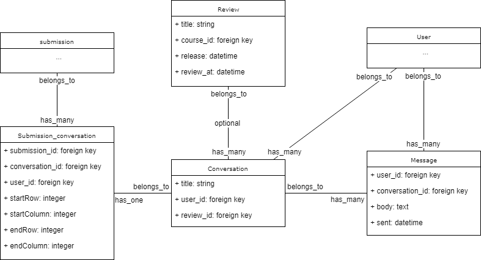
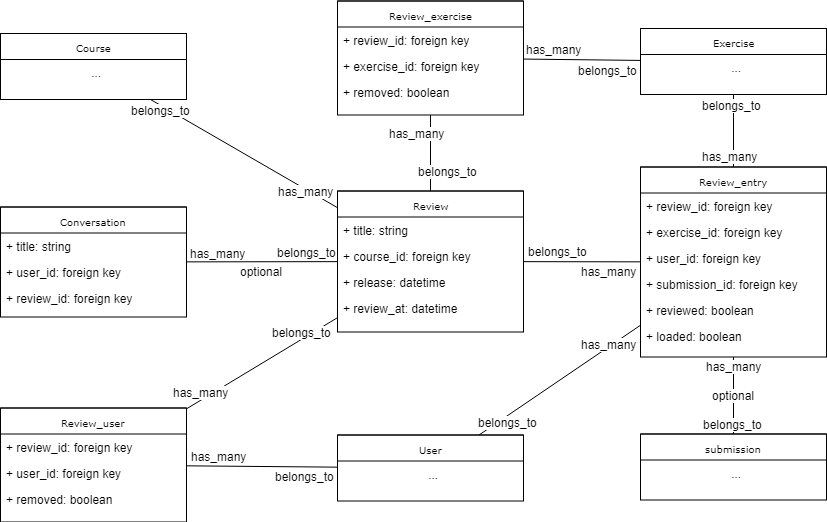

=================
Interne structuur
=================
Het prototype bestaat uit twee grote systemen: het deel dat werkt rond de reviews en het deel dat werkt rond de conversaties en berichten.
In de volgende hoofdstukken worden deze twee delen uitgebreid besproken.

In onderstaand schema worden de nieuwe modellen met hun velden weergegeven evenals de reeds bestaande klassen waarmee ze verbonden zijn. 
De methodes van de nieuwe modellen zijn weggelaten, de bestaande klassen worden weergegeven zonder verdere informatie.

Conversaties en berichten
=========================
Een conversatie is in essentie een verzameling van berichten. Dit is te vergelijken met een issue op github, een bericht met een ketting van reacties.
Een conversatie behoort toe aan de gebruiker die het eerste bericht heeft geplaatst en daarmee de conversatie is begonnen.
Het heeft ook meerdere berichten, het eerste bericht dat de conversatie begon en de reacties die daarop volgden.
Het is verbonden met een oplossing door het submission_conversation model, een tussenmodel dat buiten het verbinden van een oplossing met een conversatie ook bijhoudt of er code van de oplossing gerefereerd wordt in het eerste bericht. 
Een conversatie kan ook verbonden zijn met een review; dit wordt later verder besproken.

Een bericht hoort toe aan de gebruiker die het geplaatst heeft en aan de conversatie waarin het geplaatst is.
Het bevat zowel de tekst van het bericht als wanneer het verzonden is.

De reden dat de gerefereerde code in het submission_conversation tussenmodel zit is om toe te staan dat conversaties later gebruikt kunnen worden in situaties waar geen code aanwezig is.
De gerefereerde code wordt opgeslagen in de vorm van zijn coördinaten in de code van de oplossing. 
Zo wordt er bijgehouden in welke rij de referentie begint en op welke positie in deze rij. Insgelijks voor de laatste rij.
Hierdoor kan de gerefereerde code gemarkeerd worden in de oorspronkelijke code.

In onderstaand schema wordt het deel dat betrokken is met conversaties en berichten weergegeven.

Reviews
=================
Een review is vergelijkbaar met een sessie waarin meerdere oefeningen verbeterd worden.
Het behoort toe aan een bepaalde cursus en bevat normaal gezien meerdere conversaties.
Een review heeft meerdere oefeningen, waarmee het verbonden is door het Review_exercise tussenmodel.
Dit tussenmodel bevat een extra veld waarmee aangegeven kan worden dat een oefening niet meer in de review zit.
Met gebruikers is het volledig analoog, hier is het tussenmodel review_user met ook een extra veld om het verwijderd zijn aan te duiden.
Een review bevat een veld om aan te geven tot wanneer oplossingen aanvaard worden (het review_at veld) en een veld om aan te geven wanneer de beoordelingen zichtbaar voor de gebruikers worden.
Als dit laatste veld leeg is, dan wordt het pas vrijgegeven als de beoordelaar hier opdracht toe geeft.

Een review heeft veel review_entries, het model dat bijhoudt welke submissions al verbeterd zijn.
Het review_entry model is verbonden met een review, een oefening, een gebruiker en een oplossing.
Het symboliseert dus de beoordeling van de oplossing van een gebruiker voor een oefening.
De oplossing kan hier blanco zijn om aan te duiden dat de gebruiker voor die oefening geen oplossing heeft ingediend.
Verder bevat het velden om aan te geven of de oplossing al beoordeeld is en of de oplossing al ingeladen is.
Zodra een oplossing geladen wordt om deze te beoordelen, wordt deze vastgelegd en wordt er niet automatisch naar een recentere oplossing overgegaan als er later nieuwere oplossingen zijn.

In onderstaand schema wordt het deel dat betrokken is met de reviews weergegeven.

